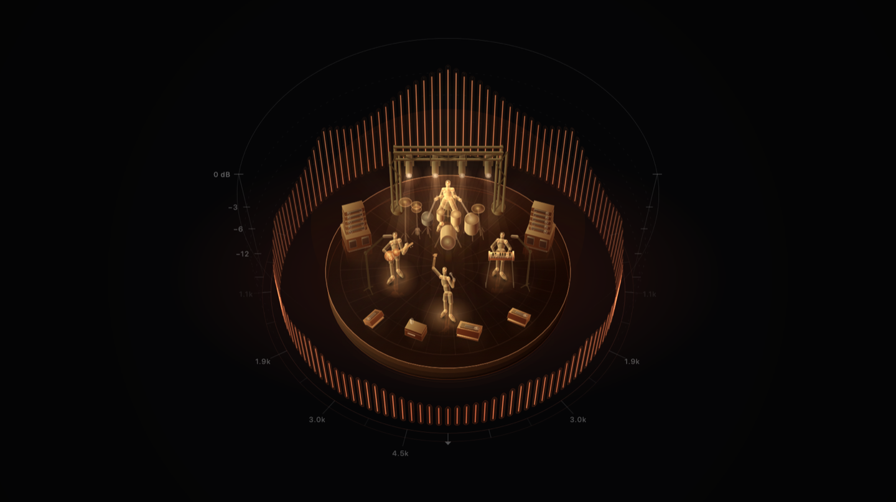
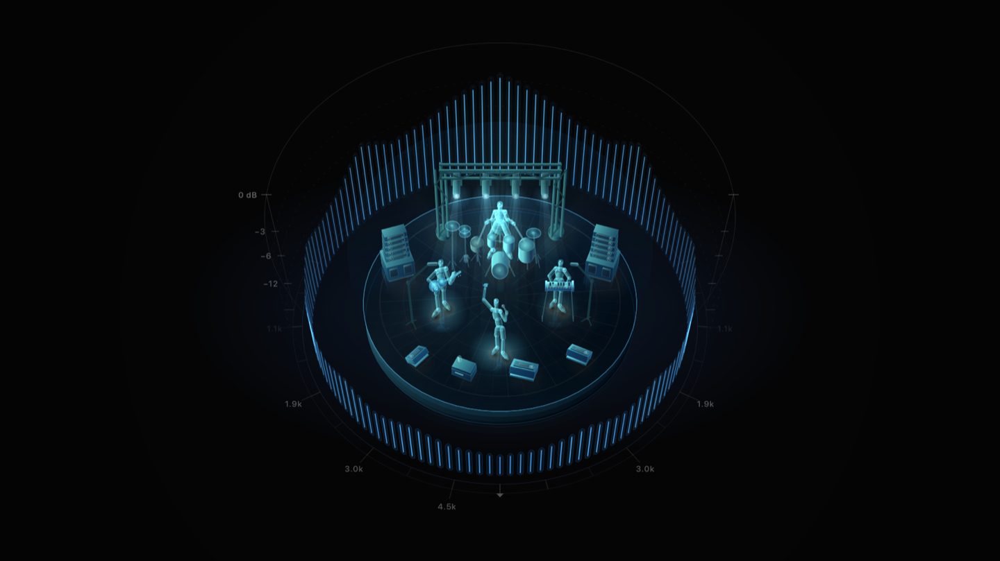

<div align="center">


# Auralis

**System audio spectrum onto [WLED](https://github.com/wled/WLED) LED strips**

Over the UDP audiosync v2 protocol. macOS 14.2+, no virtual audio driver required.

[Русский](README.md) · [Changelog](CHANGELOG.md) · [Origin and licences](NOTICE)



</div>

---

A macOS port of
[SR-WLED-audio-server-win](https://github.com/Victoare/SR-WLED-audio-server-win),
rewritten from scratch in Swift.

> **Status:** working. An app with a window and a menu bar icon, a command line
> version, Bonjour discovery of strips with a receive check, sixteen interface languages.

**It repairs itself.** Switch output to AirPods, change the sample rate, let the Mac
sleep — capture rebuilds itself and the packet stream does not break: the frame
counter stays monotonic and the gap is about 100 ms against a 2.5 second signal-loss
threshold. The sender deliberately survives the rebuild — restart the counter and
WLED-MM will drop the packets.

**Diagnostics along four axes.** There are at least four reasons a strip stays dark,
and a person cannot tell them apart: audio permission not granted, no address set,
the device not in receive mode, the processing emitting zeroes. Each is checked
separately, with advice on what to fix and a button to copy the report.

## How it differs from the Windows version

**No virtual audio driver.** System audio is read through the mechanism macOS
provides — a CoreAudio process tap. BlackHole and Loopback are not needed, and the
sound keeps going to the speakers as usual.

**The strip looks more alive.** The values in the packet now mean what the label
says, and the dynamics no longer fight themselves:

- **the loudness fields carry loudness.** The original put the ratio of the mid band
  to the maximum band there: a 48 dB change in the signal moved the value by less
  than 40 units out of 255. A dozen and a half effects feed on those fields;
- **band edges taken from the firmware itself** (43–86 … 7106–9259 Hz). On a
  logarithmic 40…10000 grid the three lowest bands got one FFT bin each — the bass
  was interpolated from neighbours;
- **a Hann window instead of FlatTop:** the latter has a main lobe four times wider,
  so a single bass tone lit several bands at once;
- **band smoothing** (25 ms up, 250 ms down) — the strip stops flickering where the
  sound is not changing;
- **the AGC no longer ducks on a beat.** The reference moves slowly and a loud band
  simply hits the ceiling: neighbouring bands drop by 1.2 dB instead of 7.5;
- **bands are folded by energy,** not by the loudest bin — the upper bands are no
  longer inflated just because they are wider;
- **10 ms of latency instead of 21,** from a 512-sample analysis hop.

A number of defects in the original are fixed too — ones that made some WLED effects
behave differently from what their authors intended:

- **the frame counter no longer resets on silence.** WLED-MM accepts a packet only if
  the counter has grown, so the original stopped driving the strip after the first pause;
- **band values are clamped to 254.** WLED wraps anything above that, so a bright peak
  turned into dim noise at the exact moment of the beat;
- **the send rate is capped at 50 packets per second** — the limit named in the
  WLED-MM documentation. Any faster and the firmware chokes;
- **the strip is faded out on exit.** Neither vanilla nor MM clears the bands on its
  own: closing the program used to leave the equaliser frozen until the strip was
  power-cycled.

## Requirements

- macOS 14.2 or newer (the CoreAudio process tap arrived in that version)
- Command Line Tools for Xcode — the full Xcode is not needed
- a WLED strip with Audio Reactive enabled in receive mode

## Build and run

### The app

```bash
./scripts/build-app.sh
open dist/Auralis.app
cp -R dist/Auralis.app /Applications/
```

The icon appears both in the menu bar and in the Dock. The menu bar carries a live
spectrum and a popover with status, packet counter and settings. The main window has
the large visualisation and every parameter, laid out across four tabs: where to send,
how it looks, why it is not working, how the app behaves.

On first launch macOS asks for two permissions: recording system audio and local
network access. From the second launch onwards the server starts by itself.

The bundle is ad-hoc signed by default, and macOS will then ask for audio permission
again after every rebuild. To avoid that, make a self-signed code signing certificate
in Keychain Access and point the script at it:

```bash
SRWLED_SIGN_IDENTITY="Certificate name" ./scripts/build-app.sh
```

### If you downloaded the app instead of building it

The `.app` on the releases page is ad-hoc signed, without an Apple Developer
certificate. macOS puts a quarantine flag on a downloaded file and refuses to open
it, claiming the app is damaged. Remove the flag:

```bash
xattr -dr com.apple.quarantine /Applications/Auralis.app
```

Or open it once via right click → **Open** and confirm in the dialog. This is not a
way around the protection but the ordinary path for software without a paid developer
signature: the sources are all here and anyone can build their own copy.

### Command line version

```bash
swift build -c release

# send to specific strips
.build/release/srwled --targets 192.168.1.50,192.168.1.51

# broadcast across the network
.build/release/srwled --mode broadcast
```

On first launch macOS asks for permission to record system audio. If no dialog
appeared, grant it by hand:
**System Settings → Privacy & Security → Audio Recording**.

All the options are in `srwled --help`; the version is `srwled --version`.

Note: the command line version still speaks Russian only. The app itself is
translated into sixteen languages.

### Comparing against the original

Every processing fix can be switched off and judged by eye on the strip:

```bash
srwled --targets 192.168.1.50 --original          # exactly like the Windows version
srwled --targets 192.168.1.50 --window flattop    # only the old window
srwled --targets 192.168.1.50 --bands custom      # only the old band grid
```

## Setting up the strip

In the WLED web interface: **Config → Usermods → AudioReactive**

- `Sync mode` — **Receive**
- `Port` — 11988 (the default)
- after changing the sync mode the strip needs a power cycle

To check that the strip is receiving the stream:

```bash
curl -s http://<strip-address>/json/info | grep -i "sound\|audio"
```

With the server running, the reply should contain `v2` and `receiving`. The firmware
sets the `v2` suffix only when a packet passed both of its checks — exactly 44 bytes
and the right header. That single line proves the format is correct.

## Tests

```bash
./scripts/test.sh
```

No test touches an audio device or sends a packet to a real network — they run on
synthetic data and a stub transport. Xcode is not required: the project uses its own
runner, since XCTest and swift-testing ship only with Xcode.

## Appearance

The visualisation is drawn in code and comes in two palettes. The frames above and
below are not mockups but the program's own output, laid down by `SRWLEDPreview` —
the same code that draws the window.



```bash
# scene frames and the app mark as PNG
SRWLED_OUT=docs swift run -c release SRWLEDPreview
```

## Cutting a release

```bash
SRWLED_ARCHIVE=1 ./scripts/build-app.sh
```

Puts `dist/SR-WLED-Server-Auralis-macos-<version>.zip` next to the bundle — the
archive for the releases page. Only the archive carries the long name, so that search
finds it next to the original Windows version; the app itself is named short.

The version lives in one place, `Sources/SRWLEDCore/Version.swift`; the build script
reads it from there and the command line version prints it with `--version`.

## Privacy

Audio is never recorded, stored or transmitted. Only 44 bytes per frame go out over
the network: 16 equaliser values and a few level numbers. The content of the sound
cannot be reconstructed from them.

## Licence

Copyright © 2026 Zakhar Sesyugin. GPL-3.0, inherited from the original project.
See [LICENSE](LICENSE) and [NOTICE](NOTICE).

Auralis is not affiliated with the WLED project, is not its official application and
is not endorsed by its authors. The WLED name is mentioned only to state compatibility.
