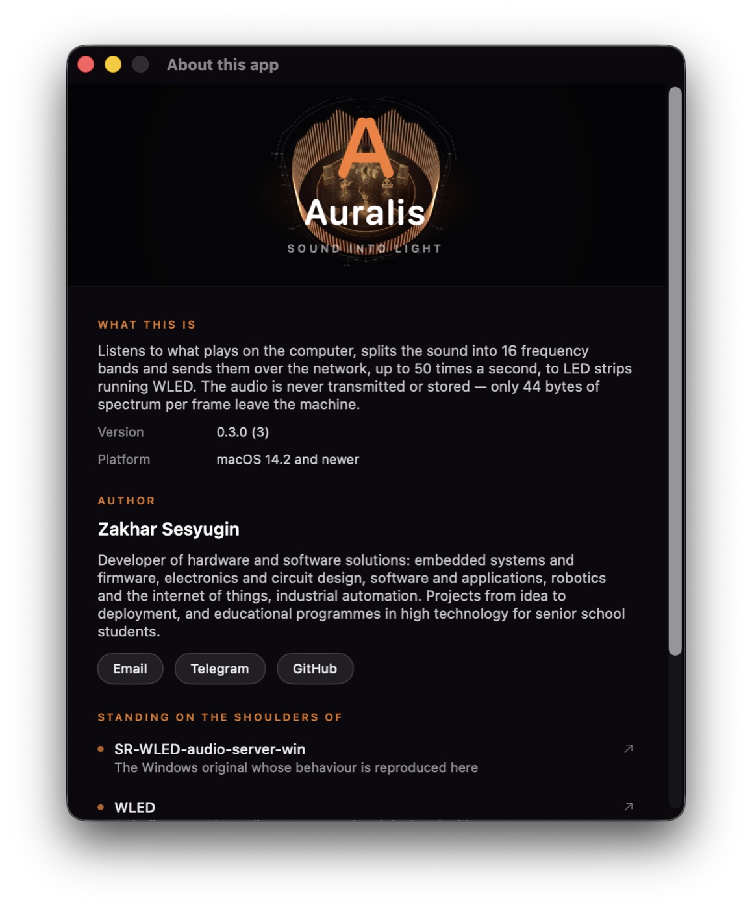

<div align="center">


# Auralis

**Спектр системного звука — на светодиодные ленты с [WLED](https://github.com/wled/WLED)**

По протоколу UDP audiosync v2. macOS 14.2+, без виртуальных аудиодрайверов.

[English](README.en.md) · [Изменения](CHANGELOG.md) · [Происхождение и лицензии](NOTICE)


</div>

---

Порт для macOS программы
[SR-WLED-audio-server-win](https://github.com/Victoare/SR-WLED-audio-server-win),
написанный заново на Swift.

> **Состояние:** работает. Приложение с окном и значком в строке меню, консольная
> версия, автопоиск лент по Bonjour с проверкой приёма, шестнадцать языков интерфейса.

**Само чинится.** Переключил вывод на AirPods, поменялась частота дискретизации,
мак ушёл в сон — захват пересобирается сам, а поток пакетов не прерывается: счётчик
кадров остаётся монотонным, разрыв около 100 мс при пороге потери сигнала 2.5 секунды.
Отправитель переживает пересборку намеренно — начни счётчик заново, и WLED-MM
отбросит пакеты.

**Диагностика по четырём признакам.** Причин, по которым лента молчит, минимум
четыре, и для человека они неразличимы: нет разрешения на звук, не задан адрес,
устройство не в режиме приёма, обработка выдаёт нули. Каждая проверяется отдельно,
с подсказкой что чинить и кнопкой «скопировать диагностику».

## Чем отличается от Windows-версии

**Не нужен виртуальный аудиодрайвер.** Системный звук читается штатным механизмом
macOS — CoreAudio process tap. Ставить BlackHole или Loopback не требуется, звук
продолжает идти в колонки как обычно.

**Картинка на ленте живее.** Значения в пакете теперь означают то, что написано на
этикетке, а динамика больше не борется сама с собой:

- **в полях громкости — действительно громкость.** Оригинал клал туда отношение
  средней полосы к максимальной: изменение сигнала на 48 дБ двигало значение
  меньше чем на 40 единиц из 255. Из этих полей питается полтора десятка эффектов;
- **полосы взяты из самой прошивки** (43–86 … 7106–9259 Гц). У логарифмической
  сетки 40…10000 три нижние полосы получали по одному бину БПФ — бас достраивался
  интерполяцией соседей;
- **окно Hann вместо FlatTop:** у последнего главный лепесток вчетверо шире, и один
  басовый тон зажигал несколько полос разом;
- **сглаживание полос** (25 мс вверх, 250 мс вниз) — лента не мерцает там, где звук
  не меняется;
- **АРУ не приседает на ударе.** Опора идёт медленно, громкая полоса просто упирается
  в потолок: просадка соседних полос 1.2 дБ вместо 7.5;
- **полосы сворачиваются по энергии,** а не по максимуму бина — верхние полосы больше
  не задраны просто из-за своей ширины;
- **задержка 10 мс вместо 21** за счёт шага анализа 512 отсчётов.

Кроме того, исправлен ряд дефектов оригинала, из-за которых часть эффектов WLED
работала не так, как задумано их авторами:

- **счётчик кадров больше не обнуляется на тишине.** WLED-MM принимает пакет только
  если счётчик вырос, поэтому оригинал переставал управлять лентой после первой паузы;
- **значения полос ограничены 254.** WLED заворачивает всё выше этого предела, из-за
  чего яркий пик превращался в тусклый мусор ровно в момент удара;
- **частота отправки ограничена 50 пакетами в секунду** — предел, названный в
  документации WLED-MM. Быстрее прошивка захлёбывается;
- **лента гасится при выходе.** Ни ваниль, ни MM не гасят полосы сами: закрытая
  программа оставляла эквалайзер застывшим до перезагрузки ленты.

## Требования

- macOS 14.2 или новее (в этой версии появился CoreAudio process tap)
- Command Line Tools для Xcode — полный Xcode не нужен
- лента с WLED, где включён Audio Reactive в режиме приёма

## Сборка и запуск

### Приложение

```bash
./scripts/build-app.sh
open dist/Auralis.app
cp -R dist/Auralis.app /Applications/
```

Значок появляется и в строке меню, и в Dock. В строке меню — живой спектр и попап
с состоянием, счётчиком пакетов и настройками. Главное окно — крупная визуализация
и панель со всеми параметрами, разложенная по четырём вкладкам: куда слать,
как выглядит, почему не работает, как ведёт себя приложение.

При первом запуске macOS спросит два разрешения: на запись системного звука и на
доступ в локальную сеть. Начиная со второго запуска сервер поднимается сам.

По умолчанию бандл подписывается ad-hoc, и тогда macOS будет спрашивать разрешение
на запись звука после каждой пересборки. Чтобы этого не было, сделай в Связке ключей
самоподписанный сертификат для подписи кода и укажи его:

```bash
SRWLED_SIGN_IDENTITY="Имя сертификата" ./scripts/build-app.sh
```

### Если приложение скачано, а не собрано

Готовый `.app` со страницы релизов подписан ad-hoc, без сертификата Apple Developer.
Скачанному файлу macOS ставит карантинную метку и отказывается его открывать —
пишет, что приложение повреждено. Метку надо снять:

```bash
xattr -dr com.apple.quarantine /Applications/Auralis.app
```

Либо один раз открыть через правую кнопку → **Открыть** и подтвердить в диалоге.
Это не обход защиты, а штатный путь для программ без платной подписи разработчика:
исходники здесь целиком, и любой может собрать своё из них сам.

### Консольная версия

```bash
swift build -c release

# отправка на конкретные ленты
.build/release/srwled --targets 192.168.1.50,192.168.1.51

# широковещательно по всей сети
.build/release/srwled --mode broadcast
```

При первом запуске macOS спросит разрешение на запись системного звука.
Если диалог не появился, выдай его вручную:
**Системные настройки → Конфиденциальность и безопасность → Запись звука**.

Все параметры — `srwled --help`, версия — `srwled --version`.
Говорит на языке системы — тех же шестнадцати, что и приложение.

### Сравнение с оригиналом

Каждое исправление обработки можно отключить и посмотреть на ленту глазами:

```bash
srwled --targets 192.168.1.50 --original          # ровно как Windows-версия
srwled --targets 192.168.1.50 --window flattop    # только старое окно
srwled --targets 192.168.1.50 --bands custom      # только старая сетка полос
```

## Настройка ленты

В веб-интерфейсе WLED: **Config → Usermods → AudioReactive**

- `Sync mode` — **Receive**
- `Port` — 11988 (значение по умолчанию)
- после смены режима синхронизации ленту нужно перезагрузить по питанию

Проверить, что лента принимает поток:

```bash
curl -s http://<адрес-ленты>/json/info | grep -i "sound\|audio"
```

При работающем сервере в ответе должно появиться `v2` и `receiving`. Суффикс `v2`
прошивка выставляет только если пакет прошёл обе её проверки — размер ровно 44 байта
и верный заголовок. То есть одна эта строка доказывает корректность формата.

## Проверки

```bash
./scripts/test.sh
```

Ни одна проверка не обращается к аудиоустройствам и не отправляет пакеты в реальную
сеть — гоняются на синтетических данных и на заглушке транспорта. Xcode не требуется:
используется собственный прогонщик, поскольку XCTest и swift-testing поставляются
только вместе с Xcode.

## Как это выглядит

Панель нужна дважды: когда настраивают и когда разбираются, почему молчит лента.
Всё остальное время она отнимает треть ширины у того, ради чего окно и открыли, —
поэтому убирается кнопкой под сценой или по ⌘⌃S. Через три секунды покоя уходит
и обвязка поверх сцены; возвращает её любое движение указателя.


**Диагностика по четырём признакам.** Не один индикатор «не работает», а четыре
независимых: звук, обработка, отправка, сами ленты. У каждого свой вердикт и своя
подсказка, что чинить; кнопка рядом кладёт весь отчёт в буфер обмена — на языке
интерфейса.


**Обработка открыта наружу.** Каждое отличие от Windows-версии — отдельный
переключатель, и одним флажком возвращается поведение оригинала целиком.
Смотреть на разницу можно глазами, на самой ленте.


**Четыре сцены и четыре палитры,** а тон столбиков ещё и берётся ползунком —
от палитры или свой на весь круг.

<p align="center">
  
  
  
</p>

**Шестнадцать языков,** включая арабский и урду с зеркальной раскладкой.
Системный диалог разрешений тоже переведён — его показывают до того, как язык
внутри программы вообще можно выбрать.


Кадры сцены и знак приложения можно нарисовать и без запуска — тем же кодом,
что рисует окно:

```bash
SRWLED_OUT=docs swift run -c release SRWLEDPreview
```

## Выпуск версии

```bash
SRWLED_ARCHIVE=1 ./scripts/build-app.sh
```

Кладёт рядом с бандлом `dist/SR-WLED-Server-Auralis-macos-<версия>.zip` — архив
для страницы релизов. Длинное имя только у архива: по нему его находят поиском
рядом с оригинальной Windows-версией, а само приложение называется коротко.

Версия задаётся в одном месте — `Sources/SRWLEDCore/Version.swift`; скрипт сборки
берёт её оттуда, консольная версия печатает по `--version`.

## Приватность

Звук не записывается, не сохраняется и никуда не передаётся. В сеть уходит только
44 байта на кадр: 16 значений эквалайзера и несколько чисел уровня. Восстановить по
ним содержимое звука невозможно.

## Лицензия




Copyright © 2026 Zakhar Sesyugin. GPL-3.0 — унаследована от оригинального проекта.
См. [LICENSE](LICENSE) и [NOTICE](NOTICE).

Auralis не связан с проектом WLED, не является его официальным приложением и не
поддерживается его авторами. Название WLED упомянуто только для указания совместимости.
