<div align="center">


# Auralis

**Музыка играет на маке — светодиодная лента в комнате повторяет её спектр.**

Без виртуальных аудиодрайверов. macOS 14.2+, ленты с прошивкой [WLED](https://github.com/wled/WLED).

[English](README.en.md) · [Скачать 0.3.0](https://github.com/sesyugin/SR-WLED-audio-server-mac/releases/latest) · [Изменения](CHANGELOG.md) · [Происхождение и лицензии](NOTICE)

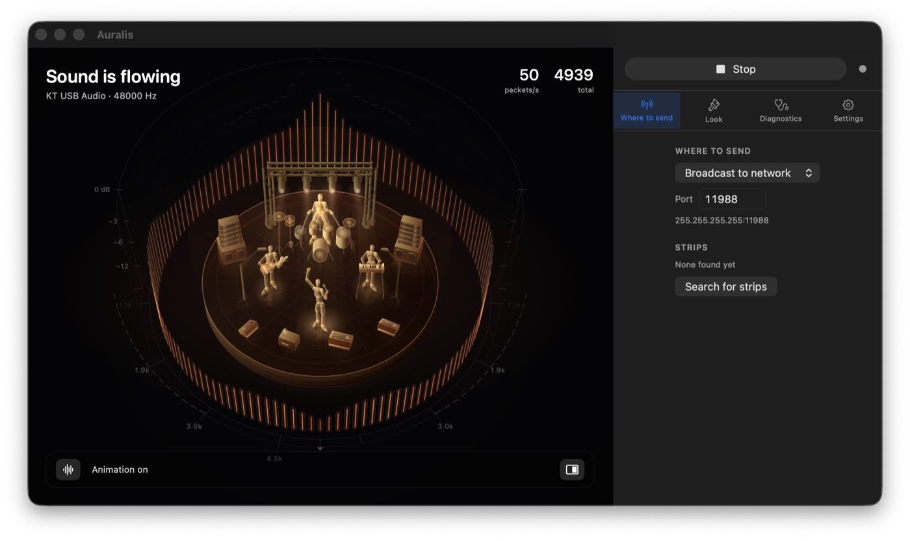

</div>

---

## Что это делает

Программа слушает то, что играет на компьютере, каждые 10 миллисекунд раскладывает
звук на 16 частотных полос и отправляет их по сети на ленту. Лента с прошивкой WLED
принимает эти 16 чисел и рисует ими свои эффекты — эквалайзер, вспышки на ударе,
бегущие волны.

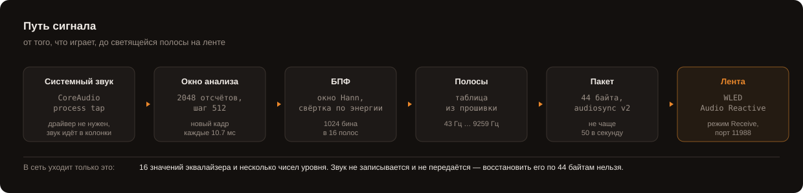

Ставить ничего под систему не нужно. Windows-версии и всем обходным путям на маке
требуется виртуальный аудиодрайвер вроде BlackHole: он подменяет звуковую карту,
чтобы поток можно было прочитать со стороны. Здесь звук читается штатным механизмом самой
macOS — **CoreAudio process tap**, — и продолжает идти в колонки как шёл.

## Как это выглядит

Панель нужна дважды: когда настраивают и когда разбираются, почему молчит лента.
Всё остальное время она отнимает треть ширины у того, ради чего окно и открыли, —
поэтому убирается кнопкой под сценой или по ⌘⌃S. Через три секунды покоя уходит
и обвязка поверх сцены; возвращает её любое движение указателя.

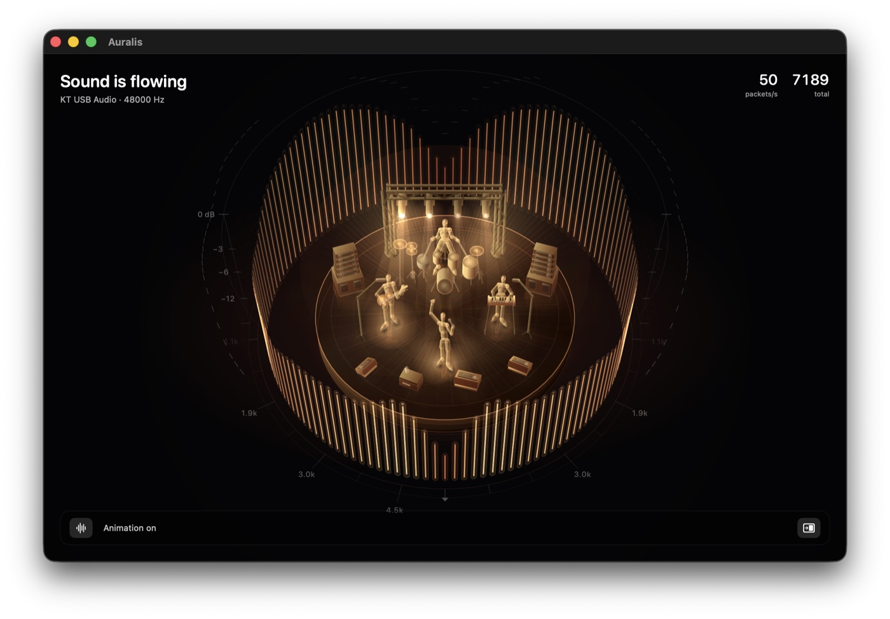

Четыре сцены и четыре палитры, тон столбиков задаётся ползунком — от палитры
или свой на весь круг.

<p align="center">
  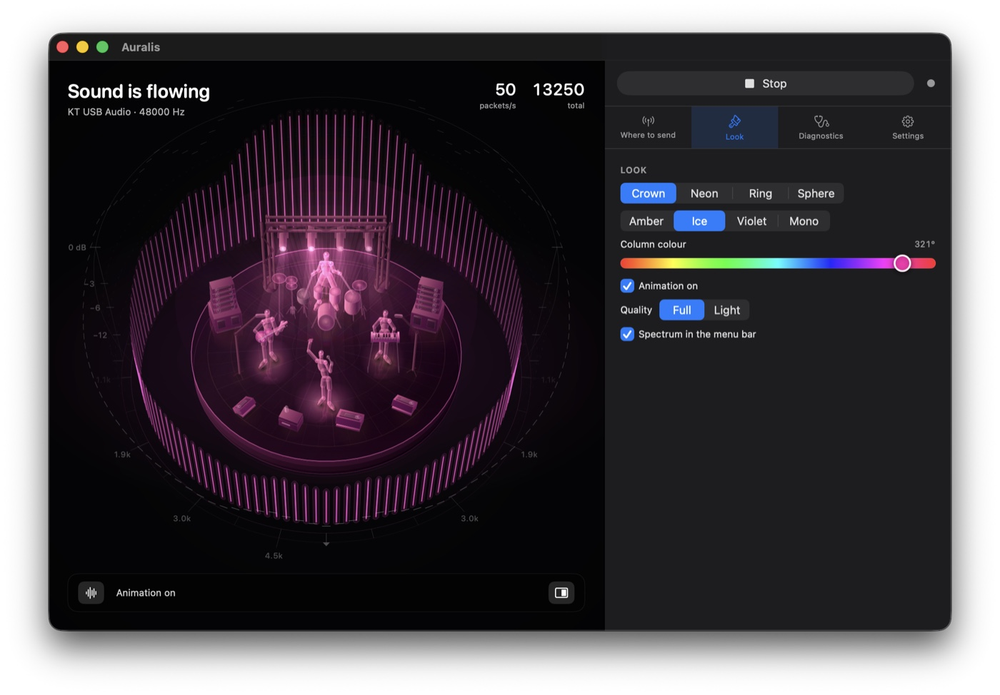
  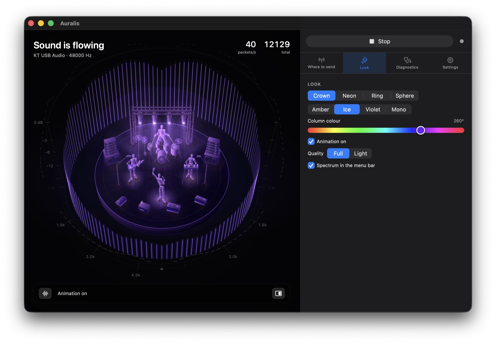
  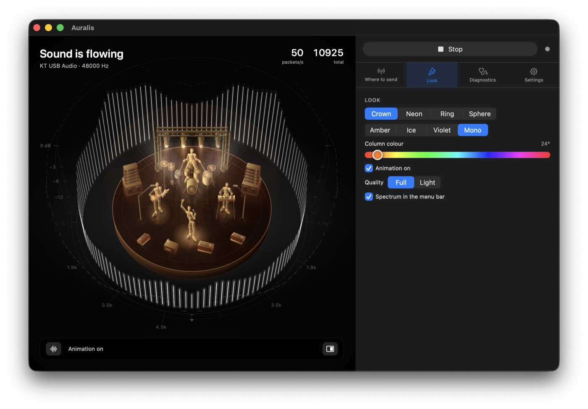
</p>

**Шестнадцать языков** — в приложении, в консольной версии и в системном диалоге
разрешений. Арабский и урду с зеркальной раскладкой.

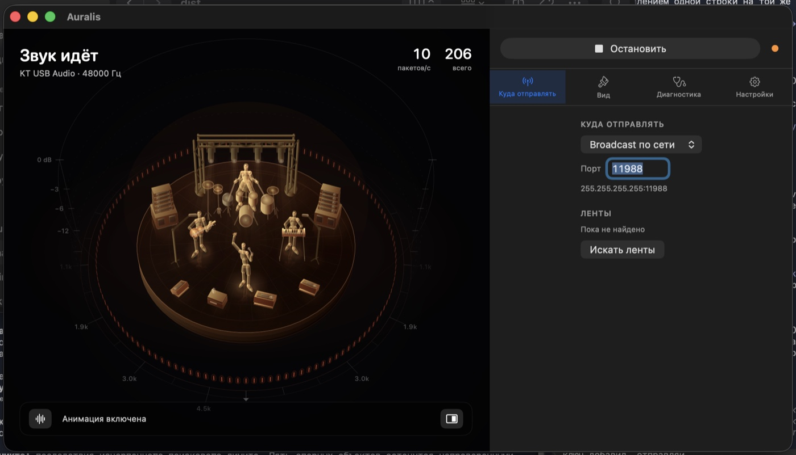

## Диагностика

Причин, по которым лента не светится, четыре, и для человека они неразличимы:
не выдано разрешение на запись звука; не задан адрес; лента не в режиме приёма;
обработка выдаёт нули. Один общий индикатор «не работает» тут бесполезен — нужен
ответ, что именно чинить.

Поэтому каждая причина проверяется отдельно, со своим вердиктом и подсказкой,
а кнопка рядом кладёт весь отчёт в буфер обмена — на языке интерфейса, чтобы его
можно было кому-то отправить.

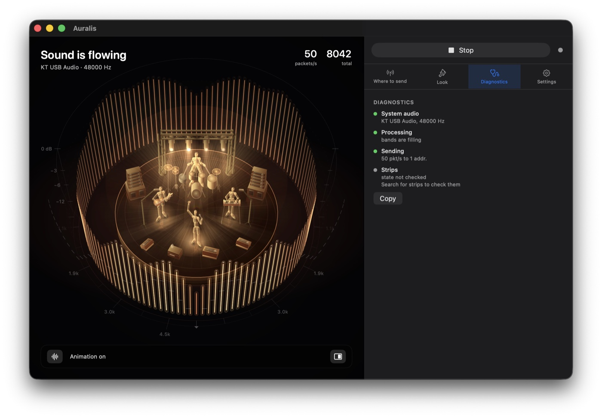

## Чем отличается от Windows-версии

Здесь не порт строка в строку: исходный код на C# не переносился, всё написано
заново на Swift. По дороге нашлось несколько мест, где оригинал расходится с тем,
чего ждёт прошивка.

### Поля пакета

Прошивка ждёт 44 байта и в каждом поле — определённую величину. Оригинал
в поля громкости клал **отношение средней полосы к максимальной**: величину,
которая почти не меняется от того, тихо играет музыка или громко. Изменение
сигнала на 48 дБ двигало значение меньше чем на 40 единиц из 255 — а из этих
полей питается полтора десятка эффектов WLED.

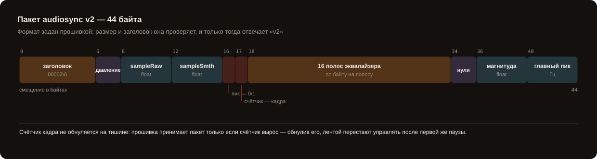

Ещё три поля считались не в той мере, что ждёт прошивка: звуковое давление
и число пересечений нуля приведены к её единицам, а счётчик кадра больше
не обнуляется на тишине — WLED-MM принимает пакет только если счётчик вырос,
и обнулив его, оригинал переставал управлять лентой после первой же паузы.

### Таблица полос

Оригинал строил полосы логарифмической сеткой от 40 до 10000 Гц. У БПФ при этом
шаг по частоте постоянный — 23.4 Гц при частоте 48 кГц и окне в 2048
отсчётов. Три нижние полосы такой сетки уже́ этого шага, то есть получают
по одному отсчёту БПФ на всю полосу; бас приходилось достраивать интерполяцией
соседей.

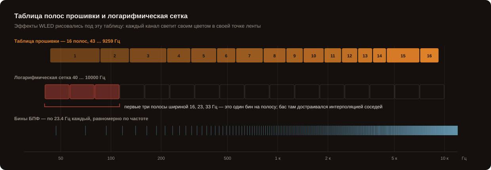

Таблица прошивки решает это неравномерностью: нижние полосы у неё шире одного
отсчёта, а верхние — намного шире, потому что там разрешение и не нужно.
Кроме того, эффекты GEQ, DJ Light, Blurz и Akemi авторы настраивали именно под эту
таблицу: каждый канал светит своим цветом в своей точке ленты.

### Обработка сигнала

| Что | Оригинал | Здесь | Что видно на ленте |
|---|---|---|---|
| Окно анализа | FlatTop | **Hann** | у FlatTop главный лепесток вчетверо шире, и один басовый тон зажигал сразу несколько полос |
| Сглаживание полос | нет | **25 мс вверх, 250 вниз** | лента не мерцает там, где звук не меняется |
| Свёртка полосы | по максимуму бина | **по энергии** | верхние полосы больше не задраны просто потому, что они шире |
| АРУ на ударе | приседает | **упирается в потолок** | просадка соседних полос 1.2 дБ вместо 7.5 |
| Задержка | 21 мс | **10 мс** | шаг анализа 512 отсчётов вместо 1024 |
| Предел полосы | 255 | **254** | WLED заворачивает всё выше предела: яркий пик превращался в тусклый мусор ровно на удар |
| Частота отправки | без предела | **не чаще 50/с** | выше прошивка не успевает; предел назван в документации WLED-MM |
| Выход из программы | лента застывает | **гасится** | ни обычный WLED, ни MM не гасят полосы сами |

Каждое отличие отключается и проверяется глазами на самой ленте — флажком
в настройках или флагом в консольной версии.

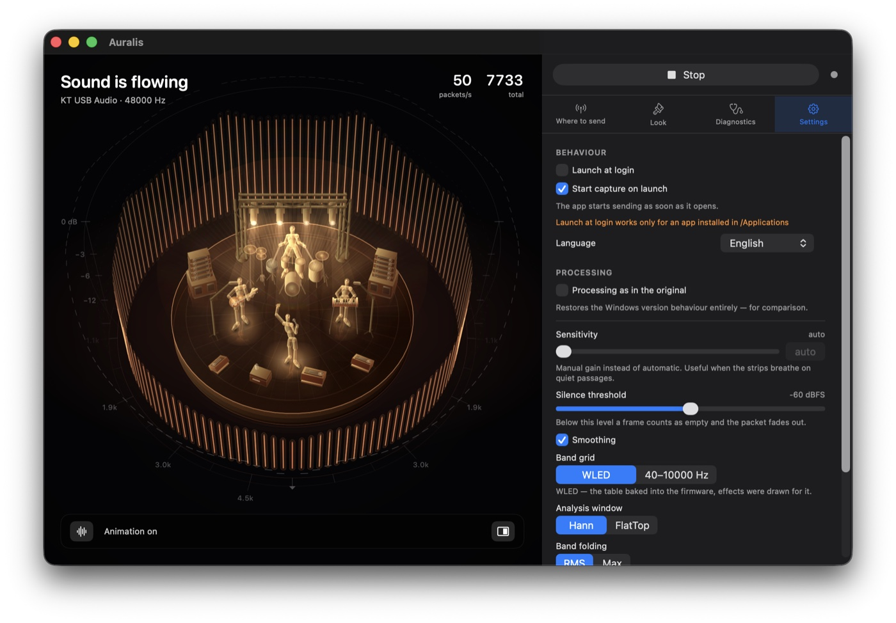

## Пересборка захвата

Переключил вывод на AirPods, поменялась частота дискретизации, мак ушёл в сон —
захват пересобирается сам. Поток пакетов при этом не прерывается: счётчик кадров
остаётся монотонным, разрыв около 100 мс при пороге потери сигнала 2.5 секунды.

Отправитель при пересборке не пересоздаётся, и это намеренно: счётчик кадров
принадлежит ему. Начать счётчик заново — значит получить от WLED-MM отказ:
пакеты со счётчиком назад она считает дублями и отбрасывает.

## Установка

Скачай архив со [страницы релизов](https://github.com/sesyugin/SR-WLED-audio-server-mac/releases/latest),
распакуй, перенеси `Auralis.app` в «Программы».

Бандл подписан **ad-hoc**, без сертификата Apple Developer. Скачанному файлу
macOS ставит карантинную метку и отказывается его открывать — пишет, что
приложение повреждено. Метку надо снять:

```bash
xattr -dr com.apple.quarantine /Applications/Auralis.app
```

Либо один раз открыть через правую кнопку → **Открыть** и подтвердить. Это
не обход защиты, а штатный путь для программ без платной подписи разработчика:
исходники здесь целиком, и любой может собрать своё из них сам.

При первом запуске macOS спросит два разрешения: на запись системного звука
и на доступ в локальную сеть.

## Настройка ленты

В веб-интерфейсе WLED: **Config → Usermods → AudioReactive**

- `Sync mode` — **Receive**
- `Port` — 11988 (значение по умолчанию)
- после смены режима синхронизации ленту нужно перезагрузить по питанию

Проверить, что лента принимает поток:

```bash
curl -s http://<адрес-ленты>/json/info | grep -i "sound\|audio"
```

При работающем сервере в ответе появится `v2` и `receiving`. Суффикс `v2`
прошивка выставляет только если пакет прошёл обе её проверки — размер ровно
44 байта и верный заголовок. То есть одна эта строка доказывает корректность
формата.

## Сборка из исходников

Нужны Command Line Tools для Xcode — полный Xcode не требуется.

```bash
./scripts/build-app.sh
open dist/Auralis.app
```

### Консольная версия

```bash
swift build -c release

# отправка на конкретные ленты
.build/release/srwled --targets 192.168.1.50,192.168.1.51

# широковещательно по всей сети
.build/release/srwled --mode broadcast
```

Все параметры — `srwled --help`, версия — `srwled --version`. Говорит на языке
системы — тех же шестнадцати, что и приложение.

Сравнение с оригиналом:

```bash
srwled --targets 192.168.1.50 --original          # ровно как Windows-версия
srwled --targets 192.168.1.50 --window flattop    # только старое окно
srwled --targets 192.168.1.50 --bands custom      # только старая сетка полос
```

### Проверки

```bash
./scripts/test.sh
```

Ни одна проверка не обращается к аудиоустройствам и не отправляет пакеты
в реальную сеть — всё на синтетических данных и на заглушке транспорта.
Xcode не нужен: используется собственный прогонщик, поскольку XCTest
и swift-testing поставляются только вместе с Xcode.

### Схемы и снимки

Схемы рисуются кодом, а не руками: нарисованная руками картинка расходится
с кодом молча. Таблица полос на схеме читается прямо из `Bucketizer.swift`.

```bash
python3 scripts/make-diagrams.py                     # схемы в docs/
SRWLED_OUT=docs swift run -c release SRWLEDPreview   # кадры сцены и знак
```

### Выпуск версии

```bash
SRWLED_ARCHIVE=1 ./scripts/build-app.sh
```

Кладёт рядом с бандлом `dist/SR-WLED-Server-Auralis-macos-<версия>.zip`.
Длинное имя только у архива: по нему его находят поиском рядом с оригинальной
Windows-версией, а само приложение называется коротко. Версия задаётся в одном
месте — `Sources/SRWLEDCore/Version.swift`.

## Приватность

Звук не записывается, не сохраняется и никуда не передаётся. В сеть уходит
только 44 байта на кадр: 16 значений эквалайзера и несколько чисел уровня.
Восстановить по ним содержимое звука невозможно.

## Лицензия

Copyright © 2026 Zakhar Sesyugin. GPL-3.0 — унаследована от оригинального
проекта [SR-WLED-audio-server-win](https://github.com/Victoare/SR-WLED-audio-server-win),
поведение которого здесь воспроизведено. См. [LICENSE](LICENSE) и [NOTICE](NOTICE).

Auralis не связан с проектом WLED, не является его официальным приложением
и не поддерживается его авторами. Название WLED упомянуто только для указания
совместимости.
